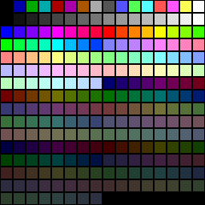
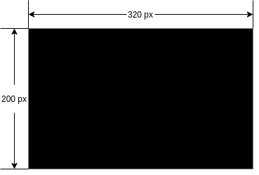
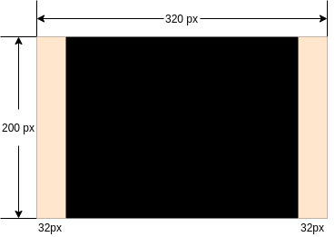
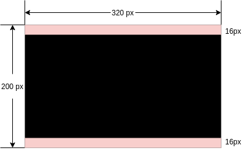
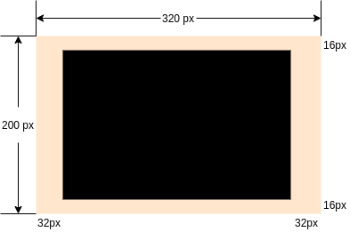

# Bootable Tanks

## Compilar

Para compilar y ejecutar el programa solo se debe ejecutar:

```shell
make
```

## Juego

### Colores
Se tiene una imagen con todos los colores soportados en modo de 8-bit.
Si se quiere cambiar un color, solo buscan la fila *i* y la  columna *j* y el valor decimal sera *(i * 15 + j)*, lo convierten a hex y ese es el color que usan.

Los colores en binario se representan de la forma RRRGGGBB, solo se necesitan 8 bits.



### Pantalla

La lógica para la pantalla es la siguiente:

* La pantalla tiene un tamaño de 320x200



* Se le hace un padding de 32px a la izquierda y a la derecha



y de 16px arriba y abajo



y en el medio se dibujará el laberinto.

* En la pantalla resultante se dibujará un laberinto con cuadros de 8x8, es decir un cuadriculla de 21x32.



* El laberinto es simétrico para ahorrar memoria. Aquí pongo comentarios con la otra mitad para que la vean. Los 1s son campos libres para andar y los 0s son paredes.

```asm
BACKGROUND:
        dw 0b0000000000000000;0000000000000000
        dw 0b0111111111111111;1111111111111110
        dw 0b0111111111100011;1100011111111110
        dw 0b0111111111100011;1100011111111110
        dw 0b0111111111111111;1111111111111110
        dw 0b0111111001111111;1111111001111110
        dw 0b0111111001111111;1111111001111110
        dw 0b0111111001111111;1111111001111110
        dw 0b0111111001111111;1111111001111110
        dw 0b0111001111111100;0011111111001110
        dw 0b0111001001111100;0011111001001110
        dw 0b0111001001111111;1111111001001110
        dw 0b0111001001111100;0011111001001110
        dw 0b0111111111111110;0111111111111110
        dw 0b0111111111100010;0100011111111110
        dw 0b0111101111111111;1111111111011110
        dw 0b0111101001111100;0011111001011110
        dw 0b0111111001111110;0111111001111110
        dw 0b0111111111111110;0111111111111110
        dw 0b0111111111111111;1111111111111110
        dw 0b0000000000000000;0000000000000000
```

### Controles
* **Flecha arriba:** mover arriba.
* **Flecha abajo:** mover abajo.
* **Flecha derecha:** mover derecha.
* **Flecha izquierda:** mover izquierda.
* **Tecla *u*:** reiniciar el juego.
* **Tecla *p*:** pausar o reanudar el juego.
* **SPACE:** disparar.
* **ESC:** salir.

### Personajes
Los personajes son representados con cuadrados. El águila es el cuadro de color rojo, el jugador es el cuadro amarillo y los tanques son los cuadros de color café.

## Links de referencia
* [Boot Sector Graphical Programming - Tutorial](https://xlogicx.net/Boot_Sector_Graphical_Programming_-_Tutorial.html)
* [Nanochess](https://nanochess.org/)
* [FBird](https://github.com/nanochess/fbird)
* [BootRogue](https://github.com/nanochess/bootRogue)
* [Pillman](https://github.com/nanochess/Pillman)
